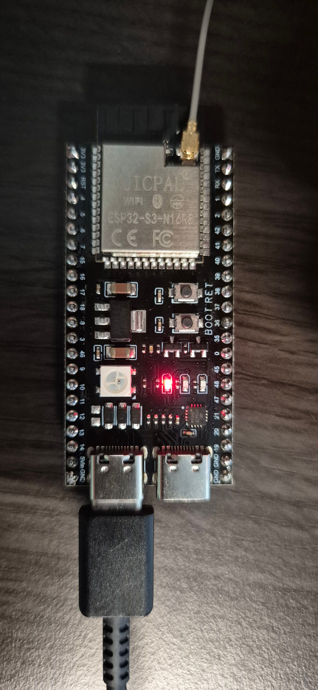
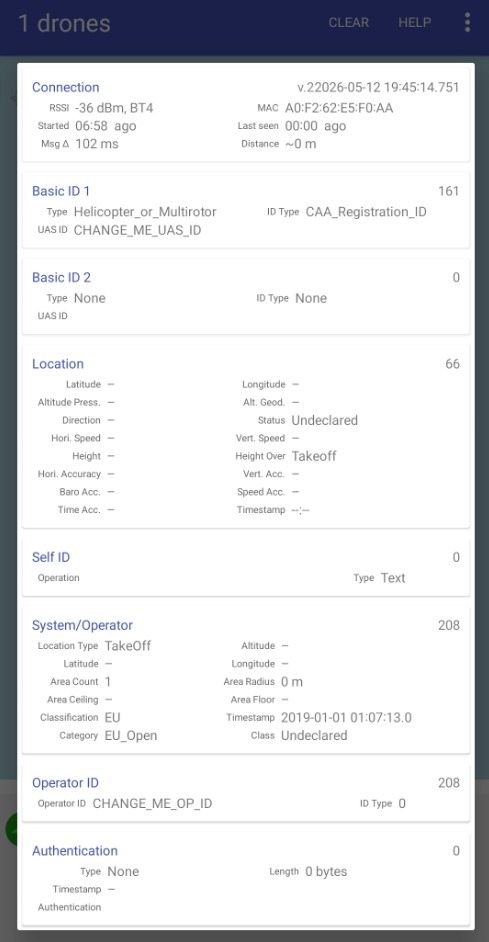

ESP32-S3 Remote ID add-on module firmware targeting EU UAS Regulation compliance, built on ESP-IDF and OpenDroneID.

The firmware broadcasts the four mandatory message types required by EU Commission Delegated Regulation (EU) 2019/945 and implementing Regulation (EU) 2021/664, encoded per ASTM F3411-22a (OpenDroneID): Basic ID, Location/Vector, System, and Operator ID. Transmission is over Bluetooth LE legacy advertising using service UUID `0xFFFA`. Payload encoding uses the official [`opendroneid-core-c`](https://github.com/opendroneid/opendroneid-core-c) library, included as a git submodule.

Each BLE advertisement carries one ODID message as a standard Service Data AD structure:

```text
0xFFFA service data = 0x0D | message_counter | 25-byte OpenDroneID message
```

The `0xFFFA` UUID is assigned by the Bluetooth SIG for UAS Remote ID and is the universal identifier all compliant receivers scan for. The `0x0D` byte is the Bluetooth SIG Open Drone ID Application Code defined in ASTM F3411-22a. It is part of the standard, not specific to any platform.

Any compliant receiver can read these advertisements:

- **Android** apps such as [`opendroneid/receiver-android`](https://github.com/opendroneid/receiver-android) filter on the `0x0D` application code to identify Remote ID packets among general BLE traffic.
- **iOS** third-party apps use the `0xFFFA` service UUID for discovery; iOS 16 and later also includes native OS-level Remote ID detection.
- **Dedicated scanners** authority and enforcement hardware reads the same standardised packet format.

<p align="center">
  
  <br>
  <em>ESP32-S3 board with external BLE/WiFi antenna running the Remote ID firmware.</em>
</p>

## Configuration

All identity and position fields are set through ESP-IDF's Kconfig system. Run:

```sh
make menuconfig
```

and navigate to **ESP Remote ID**. The sections below explain what each option means and which values are legally required.

> **Note:** The firmware is protocol-compliant with ASTM F3411 and the EU UAS Regulation (EU) 2019/945 / 2021/664 broadcast requirements. Whether your specific operation is legal depends on your national CAA rules, aircraft registration, and operating category. This firmware does not substitute for regulatory advice.

### Required: UAS ID and Operator ID

| Option | Description |
|--------|-------------|
| **UAS ID** | Unique identifier for the aircraft, broadcast in the Basic ID message. Max 20 characters. |
| **Operator registration ID** | Your national pilot/operator registration number (e.g. an EASA number like `FIN87ASTRDGE12K8`), broadcast in the Operator ID message. Max 20 characters. |

Set both to your actual registration values before any flight. The placeholder defaults (`CHANGE_ME_*`) are not valid for operation.

### UAS ID type

| Drone type | Correct setting |
|------------|-----------------|
| Self-built, no manufacturer serial | **CAA Registration ID** use your national operator registration number as the UAS ID |
| Has a manufacturer serial (ANSI/CTA-2063-A) | **Serial Number** |

For most self-built drones the UAS ID and Operator ID will be the same string: your national operator registration number. For Belgium, you can find your CAA Registration ID in the portal of "Directoraat Generaal Luchtvaart" after obtaining the necessary licenses.

### UA type

Select the airframe type that matches your aircraft. **Helicopter / Multirotor** is the default and covers most DIY multirotors.

### EU equipment class and operation category

| Scenario | Class | Category |
|----------|-------|----------|
| Self-built drone (no CE class label) | **Undeclared** *(default)* | **Open** |
| Factory drone with CE class label | C0 - C6 as marked | Open / Specific / Certified |

Self-built drones do not carry a C-class label. Setting the class to anything other than **Undeclared** when no CE mark exists is incorrect. The default Kconfig values (`Undeclared` class, `Open` category) are the correct starting point for the vast majority of self-built aircraft.

### Position (Location and System messages)

The Location and System messages must be broadcast at 1 Hz regardless of whether position is known. Two modes are supported:

**No position available (default: `Broadcast a known takeoff position` = disabled)**

The messages are populated with the ASTM F3411 invalid sentinel values:

| Field | Sentinel value |
|-------|---------------|
| Latitude / Longitude | 0 |
| Altitude (baro, geo, height) | −1000 m |
| Speed (horizontal / vertical) | 255 / 63 |
| Direction | 361° |
| Timestamp | 0xFFFF |
| All accuracy fields | Unknown |
| Status | Undeclared |

This is protocol-compliant. The broadcast system is active and all four message types are transmitted; receivers will decode the messages and display the UAS ID while showing the position as unknown.

**Known takeoff position (`Broadcast a known takeoff position` = enabled)**

Enable this option and enter the takeoff coordinates. The firmware latches these values at compile time and broadcasts them as the UA and operator position (EU regulation permits using the takeoff location as the operator location for add-on modules).

| Option | Format | Example |
|--------|--------|---------|
| Takeoff latitude | Degrees × 10⁶ (signed) | `50962290` for 50.962290° N |
| Takeoff longitude | Degrees × 10⁶ (signed) | `4454977` for 4.454977° E |
| Takeoff altitude | Whole metres above WGS-84 ellipsoid | `50` |

Obtain the WGS-84 altitude from a GNSS receiver or an online tool such as [https://www.unavco.org/software/geodetic-utilities/geoid-height-calculator/geoid-height-calculator.html](https://www.unavco.org/software/geodetic-utilities/geoid-height-calculator/geoid-height-calculator.html).

### Minimum configuration checklist

Before flashing for any actual operation:

- [ ] Set **UAS ID** to your aircraft identifier (operator registration number for self-builds)
- [ ] Set **Operator registration ID** to your national CAA/EASA pilot registration number
- [ ] Set **UAS ID type** to **CAA Registration ID** (unless you have a CTA-2063-A serial)
- [ ] Set **UA type** to match your airframe
- [ ] Leave **EU equipment class** as **Undeclared** if your drone has no CE class label
- [ ] Set **EU operation category** to **Open** (or your authorised category)
- [ ] Optionally enable **Broadcast a known takeoff position** and enter your takeoff coordinates

## Prerequisites

- ESP32-S3 board
- ESP-IDF environment, preferably the included devcontainer
- Initialized submodules:

```sh
git submodule update --init --recursive
```

For the optional BLE validation script on macOS:

```sh
python3 -m pip install bleak
```

## Development

Open the repository in the devcontainer. The container is based on Espressif's ESP-IDF image and includes `idf.py`, CMake, Ninja, `socat`, `clang-format`, and related firmware tooling.

Common commands inside the devcontainer:

```sh
make build
make flash
make monitor
```

The default ESP serial device inside the container is `/dev/ttyESP32`. Override it with `ESPPORT` if needed:

```sh
make flash ESPPORT=/dev/ttyACM0
```

## Transmit Power

OpenDroneID BLE reception range is not guaranteed by a fixed distance in the EU documents; practical range depends on transmitter power, receiver hardware, antenna design, enclosure, orientation, and RF environment. This firmware therefore makes BLE advertising TX power explicit and configurable.

The default is `+9 dBm`, the highest ESP32-S3 BLE level exposed by ESP-IDF:

```text
CONFIG_REMOTEID_BLE_TX_POWER_P9=y
```

Change it with `make menuconfig` under `ESP Remote ID -> BLE advertising TX power`, or by editing `sdkconfig.defaults` before regenerating `sdkconfig`. Keep the configured level within the limits of your board, antenna, enclosure, and local RF rules.

## macOS Serial Bridge

Docker Desktop on macOS does not expose `/dev/cu.*` serial devices directly to Linux containers. Use `socat` to bridge the ESP32-S3 USB serial device from the host into the devcontainer.

On the macOS host:

```sh
brew install socat
ls /dev/{cu,tty}.usb*
make bridge-host HOST_SERIAL=/dev/cu.usbmodemXXXX
```

Inside the devcontainer, in a second terminal:

```sh
make bridge-container
```

Keep both bridge commands running while flashing or monitoring through `/dev/ttyESP32`.

## BLE Validation

After flashing, verify the advertisements from macOS. Pass your configured takeoff coordinates to the `--near-lat` / `--near-lon` filters, or omit them to see all OpenDroneID advertisements:

```sh
python .dev/scripts/detect-opendroneid-ble.py --timeout 30
# or, to filter by proximity to a known location:
python .dev/scripts/detect-opendroneid-ble.py --timeout 30 --near-lat <lat> --near-lon <lon>
```

Expected output includes `app_code=0x0d` and message types such as:

- `type=0 (Basic ID)`
- `type=1 (Location)`
- `type=4 (System)`
- `type=5 (Operator ID)`

If the scanner sees valid advertisements but a phone app does not, check that Bluetooth and location permissions are granted and that the app supports BLE legacy Remote ID reception.

The screenshot below shows the OpenDroneID Android app receiving live advertisements from the module. The placeholder identifiers (`CHANGE_ME_UAS_ID`, `CHANGE_ME_OP_ID`) are visible, replace these with your registration details before any flight.

<p align="center">
  
</p>

## CI

GitHub Actions builds the firmware in `.github/workflows/firmware.yml` using Espressif's `idf:release-v5.5` container. The workflow runs on pull requests, pushes to `main` or `development`, and manual dispatch.

The build job uses a target matrix. It currently contains only `esp32s3`; add more ESP-IDF targets there when the firmware supports them. Successful runs upload the bootloader, partition table, app binary, ELF, map file, and flash arguments as workflow artifacts.

## Notes

- `make build` runs `idf.py set-target esp32s3 build` to avoid stale local `sdkconfig` target settings.
- `make flash` uses the `/dev/ttyESP32` bridge and leaves reset control to the bridge setup.
- Generated ESP-IDF files such as `build/`, `sdkconfig`, and `sdkconfig.old` are intentionally ignored.
